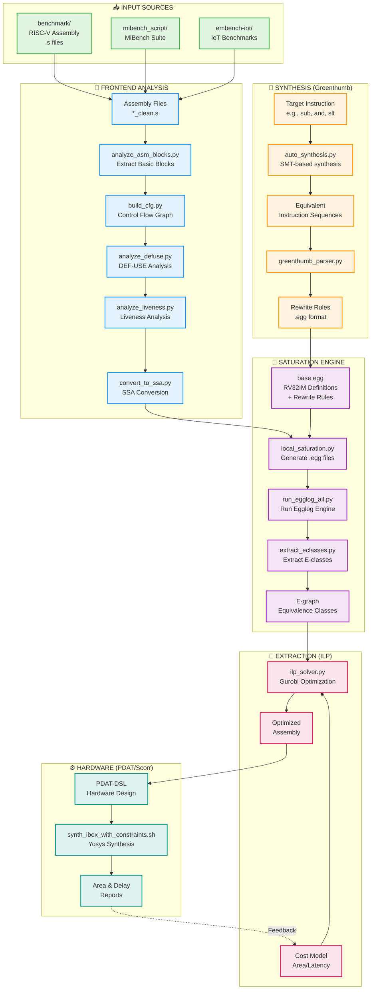

# E-Graph ISA Compiler Co-Design Workflow Guide

## 🏗️ Repository Architecture Overview

This repository implements a sophisticated compiler-hardware co-design system using e-graph equality saturation for RISC-V processor optimization.

## 📊 System Architecture Flowchart



## 📁 Directory Structure & Purpose

### Core Components

| Directory | Purpose | Key Files |
|-----------|---------|-----------|
| **`riscv_greenthumb/`** | Instruction synthesis using SMT solvers | `auto_synthesis.py`, `synthesize.rkt` |
| **`frontend/`** | 5-stage program analysis pipeline | `analyze_*.py`, `run_full_analysis.sh` |
| **`Saturation/`** | E-graph equality saturation engine | `base.egg`, `local_saturation.py` |
| **`program_synthesis/`** | Synthesis result parsing | `greenthumb_parser.py`, `inject_rewrites.py` |
| **`Extractor/`** | ILP-based optimal extraction | `ilp_solver.py`, `run_extractor.sh` |
| **`PdatScorrWrapper/`** | Hardware synthesis & verification | `synth_ibex_with_constraints.sh` |
| **`backend/`** | Cost model extraction | `parse_area_delay.py` |
| **`benchmark/`** | Test programs (RISC-V assembly) | `*_clean.s` files |
| **`mibench_script/`** | MiBench benchmark integration | `spike-wrapper.sh` |
| **`egglog/`** | Core e-graph library (Rust) | 8 workspace crates |
| **`output/`** | Generated analysis results | Structured outputs |

### Output Directory Structure
```
output/
├── frontend/                 # Frontend analysis results
│   └── <program_name>/
│       ├── basic_blocks/     # Original blocks
│       ├── basic_blocks_ssa/ # SSA form blocks
│       ├── basic_blocks_egglog/ # E-graph .egg files
│       ├── basic_blocks_json/   # JSON representations
│       ├── basic_blocks_eclass/ # E-class annotations
│       ├── cfg.json          # Control flow graph
│       ├── liveness.json     # Liveness analysis
│       └── defuse.json       # DEF-USE chains
├── ilp/                      # ILP extraction results
└── diff/                     # Optimization comparisons
```

## 🚀 Complete Workflow: Step-by-Step Scripts

### Prerequisites Setup
```bash
# 1. Setup environment
export PATH=$HOME/riscv/bin:$PATH  # RISC-V toolchain
module load gurobi                  # For ILP solver

# 2. Build egglog (if needed)
cd egglog
cargo build --release
cd ..

# 3. Setup Greenthumb environment
cd riscv_greenthumb
./setup-env.sh
cd ..
```

### Phase 1: Instruction Synthesis (Optional - for new instructions)
```bash
# Synthesize equivalent sequences for instructions
cd riscv_greenthumb/riscv
python3 auto_synthesis.py programs/alternatives/single/sub.s --min 3 --max 5
cd ../..

# Parse synthesis results into rewrite rules
cd program_synthesis
python3 greenthumb_parser.py ../riscv_greenthumb/riscv/output/sub_synthesis.s
python3 inject_rewrites.py  # Inject into base.egg
cd ..
```

### Phase 2: Program Analysis Pipeline
```bash
# Run complete frontend analysis (5 steps)
cd frontend
./run_full_analysis.sh dijkstra_small_O3 basicmath_small_O3
# Or for single program:
./run_full_analysis.sh dijkstra_small_O3
cd ..
```

**Individual Steps (if needed):**
```bash
# Step 1: Extract basic blocks
python3 frontend/analyze_asm_blocks.py benchmark/dijkstra_small_O3_clean.s -o output/frontend

# Step 2: Build CFG
python3 frontend/build_cfg.py output/frontend/dijkstra_small_O3 -v

# Step 3: DEF-USE analysis
python3 frontend/analyze_defuse.py output/frontend/dijkstra_small_O3 -v

# Step 4: Liveness analysis
python3 frontend/analyze_liveness.py output/frontend/dijkstra_small_O3 -v

# Step 5: SSA conversion
python3 frontend/convert_to_ssa.py output/frontend/dijkstra_small_O3 -v
```

### Phase 3: E-graph Saturation
```bash
# Run complete saturation pipeline (3 steps)
cd Saturation
./run_saturation.sh dijkstra_small_O3 basicmath_small_O3
cd ..
```

**Individual Steps:**
```bash
# Step 1: Generate .egg files
python3 Saturation/local_saturation.py output/frontend/dijkstra_small_O3 -v

# Step 2: Run egglog engine
python3 Saturation/run_egglog_all.py output/frontend/dijkstra_small_O3 -v

# Step 3: Extract e-classes
python3 Saturation/extract_eclasses.py output/frontend/dijkstra_small_O3 -v \
  --egglog /path/to/egglog/binary
```

### Phase 4: Optimal Extraction (ILP)
```bash
# Extract optimal program using ILP
cd Extractor
./run_extractor.sh dijkstra_small_O3 1  # best_k=1
# Or with multiple solutions:
./run_extractor.sh dijkstra_small_O3 5  # best_k=5
cd ..
```

### Phase 5: Verification & Testing
```bash
# Verify correctness of optimized programs
cd benchmark
./run_and_verify_clean.sh  # Run all programs
./run_and_verify_clean.sh dijkstra_small_O3_clean.s  # Single program
cd ..
```

### Phase 6: Hardware Synthesis (Optional)
```bash
# Synthesize hardware with constraints
cd PdatScorrWrapper/ScorrPdat
./synth_ibex_with_constraints.sh
./batch_synth.sh  # For multiple configurations
cd ../..

# Extract area/delay for cost model
python3 backend/parse_area_delay.py
```

## 🔄 Batch Processing

### Process Multiple Programs
```bash
# Full pipeline for multiple programs
programs="dijkstra_small_O3 basicmath_small_O3 bitcount_small_O3"

# 1. Frontend analysis
frontend/run_full_analysis.sh $programs

# 2. Saturation
Saturation/run_saturation.sh $programs

# 3. Extraction (individual)
for prog in $programs; do
    Extractor/run_extractor.sh $prog 1
done
```

## 📊 Key Configuration Files

| File | Purpose |
|------|---------|
| `Saturation/base.egg` | RV32IM instruction definitions & rewrite rules |
| `Saturation/rewrites/*.egg` | Additional rewrite rule sets |
| `backend/cost_model.json` | Hardware cost parameters |
| `pyproject.toml` | Python package configuration |
| `egglog/Cargo.toml` | Rust workspace configuration |

## 🔍 Debugging & Monitoring

### Check Intermediate Results
```bash
# View basic blocks
cat output/frontend/dijkstra_small_O3/basic_blocks/block_0.txt

# View SSA form
cat output/frontend/dijkstra_small_O3/basic_blocks_ssa/block_0.txt

# View e-graph
cat output/frontend/dijkstra_small_O3/basic_blocks_egglog/block_0.egg

# Check e-classes
cat output/frontend/dijkstra_small_O3/basic_blocks_eclass/block_0.txt
```

### Visualize E-graphs
```bash
# JSON files can be visualized with external tools
ls output/frontend/dijkstra_small_O3/basic_blocks_json/*.json
```

### End-to-end
```bash
./run_multi_scale_variants.sh --enable-freq-analysis --enable-shift-constraints
./run_multi_scale_variants.sh -t 600 --enable-freq-analysis --enable-shift-constraints --enable-cache-latencies
```

## 📈 Performance Metrics

The system optimizes for:
- **Area**: Hardware resource usage
- **Latency**: Execution cycles
- **Power**: Energy consumption (derived)

Cost model feedback from hardware synthesis informs the ILP solver for optimal extraction.

## 🛠️ Common Issues & Solutions

1. **Egglog not found**: Build with `cargo build --release` in `egglog/` directory
2. **Gurobi license**: Ensure `module load gurobi` or valid license
3. **RISC-V tools missing**: Install toolchain and set `PATH`
4. **Synthesis timeout**: Adjust timeout in scripts (default 180s)

## 📚 Further Documentation

- Greenthumb: See `riscv_greenthumb/README.md`
- Frontend: See `frontend/README.md`
- Saturation: See `Saturation/README.md`
- Hardware: See `PdatScorrWrapper/README.md`

---

*Generated for the E-Graph ISA Compiler Co-Design Project*